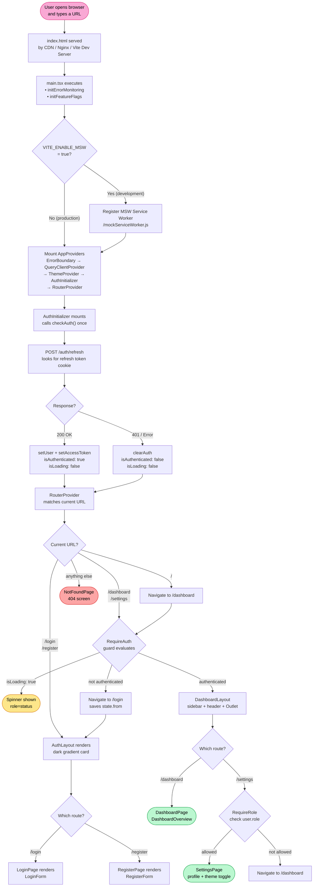
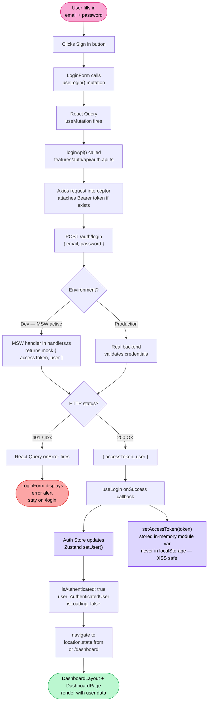
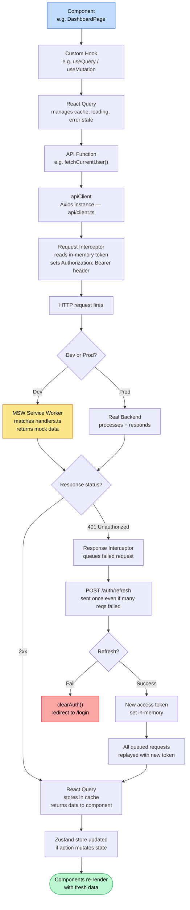
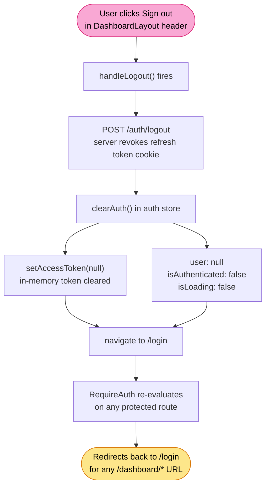
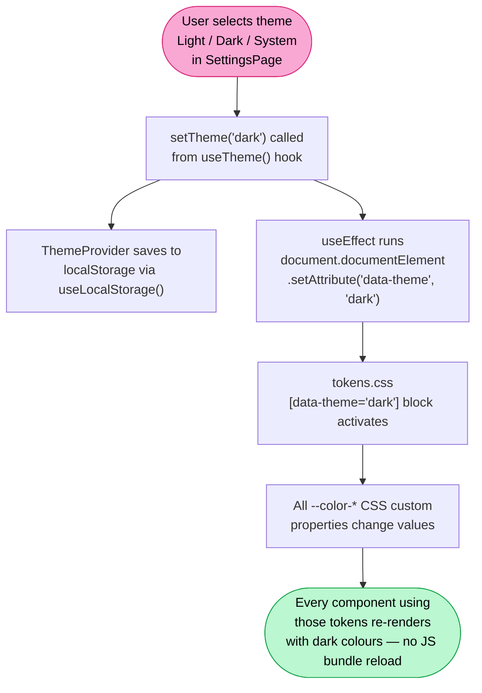

# Application Flow

A complete walkthrough of how the app boots, authenticates, routes, and renders — in execution order.

---

## Visual Flowcharts

> These diagrams render in VS Code with the Markdown Preview or any Mermaid-aware viewer (GitHub, Notion, etc.).

---

### Chart A — Full App Boot + User Journey

From the moment the browser loads the page to the user landing on the Dashboard.



---

### Chart B — Login Form: User Interaction + Data Flow

What happens inside the data layer when a user submits the login form.



---

### Chart C — API Request Lifecycle (any request after login)

How every API call travels from a component through the data layer and back.



---

### Chart D — Logout Flow



---

### Chart E — Theme Toggle Flow



---

## Detailed Execution Notes

The sections below explain every step above in plain prose with full ASCII traces.

---

## 1. Browser Requests the Page

```
User types URL in browser
        │
        ▼
CDN / Nginx / Vite Dev Server
        │
        ▼
  serves index.html
```

`index.html` is the only real HTML file. It has two jobs:
- Provide `<div id="root">` — the empty container React will own
- Load `src/main.tsx` as an ES module — this is where JavaScript starts executing

---

## 2. Vite Build Process (production only)

```
vite.config.ts
      │
      ├── @tailwindcss/vite   → scans all .tsx files, generates only used CSS classes
      ├── @vitejs/plugin-react → transforms JSX, enables Fast Refresh in dev
      ├── resolve.alias @/    → maps @/ to src/ so imports resolve correctly
      └── build.rollupOptions
            └── manualChunks  → splits output into:
                  ├── vendor-react.js   (React + ReactDOM)
                  ├── vendor-router.js  (React Router)
                  ├── vendor-query.js   (TanStack Query)
                  ├── vendor-state.js   (Zustand)
                  └── [page].js         (one chunk per lazy-loaded page)
```

In development, no bundling happens — Vite serves files as native ES modules on demand.

---

## 3. `main.tsx` — Startup Sequence

```
main.tsx starts executing
        │
        ├── 1. import '@/styles/globals.css'
        │         └── Tailwind base styles + CSS custom properties (tokens) injected into <head>
        │
        ├── 2. initErrorMonitoring()   → Sentry stub, must be ready before any render
        │   initFeatureFlags()         → local feature flag store initialized
        │
        ├── 3. mount() — async function
        │         │
        │         ├── if (env.ENABLE_MSW)        ← true in .env.development
        │         │     await import('@/tests/mocks/browser')
        │         │     await worker.start()     ← service worker registered in browser
        │         │     all fetch/axios calls now intercepted by MSW handlers
        │         │
        │         └── createRoot(document.getElementById('root'))
        │                   .render(<StrictMode> ... </StrictMode>)
        │
        └── 4. reportWebVitals()   → hooks into browser performance APIs (non-blocking)
```

---

## 4. Provider Tree — Wrapping the App

```
<StrictMode>                    ← React dev mode: double-invokes renders to catch bugs
  <AppProviders>
    <ErrorBoundary>             ← catches any unhandled render error, shows fallback UI
      <QueryClientProvider>     ← makes TanStack Query client available app-wide
        <ThemeProvider>         ← reads theme from localStorage, sets data-theme on <html>
          <AuthInitializer>     ← fires checkAuth() once on mount to restore session
            <RouterProvider>    ← hands control to React Router, renders based on URL
```

Each layer must wrap the layers inside it:
- `QueryClientProvider` wraps everything because any component can call `useQuery`
- `ThemeProvider` wraps everything because any component can call `useTheme()`
- `AuthInitializer` wraps the router so auth is resolved before route guards run

---

## 5. Auth Initialization — `AuthInitializer`

This is the most critical startup step. Without it, `isLoading` stays `true` forever.

```
AuthInitializer mounts
        │
        └── useEffect(() => checkAuth(), [])
                  │
                  ▼
        POST /auth/refresh
                  │
        ┌─────────┴──────────┐
        │                    │
      200 OK               401 / network error
        │                    │
        ▼                    ▼
  setAccessToken()        clearAuth()
  fetchCurrentUser()      isLoading: false
  setUser(user, token)    isAuthenticated: false
  isLoading: false
  isAuthenticated: true
```

The result feeds directly into every route guard that calls `useAuthStore`.

---

## 6. React Router — Route Matching

```
RouterProvider receives current URL
        │
        ▼
routes.tsx — route tree evaluated top to bottom

URL: /              → <Navigate to="/dashboard" replace />
URL: /login         → AuthLayout > LoginPage
URL: /register      → AuthLayout > RegisterPage
URL: /dashboard     → RequireAuth > DashboardLayout > DashboardPage
URL: /dashboard/settings → RequireAuth > DashboardLayout > RequireRole > SettingsPage
URL: (anything else) → NotFoundPage
```

Every page component is loaded with `React.lazy()` — its JavaScript chunk is only
downloaded when the route is first visited.

---

## 7. Route Guard — `RequireAuth`

```
RequireAuth evaluates
        │
        ├── isLoading: true   →  show spinner (session check still in-flight)
        │
        ├── isAuthenticated: false  →  <Navigate to="/login" state={{ from: location }} />
        │                                └── preserves where the user was trying to go
        │
        └── isAuthenticated: true  →  render children (the layout + page)
```

---

## 8. Route Guard — `RequireRole`

```
RequireRole({ roles: ['admin', 'editor'] }) evaluates
        │
        ├── user.role is in allowed list  →  render children (SettingsPage)
        │
        └── user.role NOT in list  →  <Navigate to="/dashboard" />
```

---

## 9. Layout Renders

```
DashboardLayout renders
        │
        ├── <aside>  sidebar
        │     └── reads sidebarCollapsed from Zustand UI store
        │     └── highlights active link by matching location.pathname
        │
        ├── <header>  top bar
        │     └── reads user.name from Zustand auth store
        │     └── Sign out button → calls logout() → navigate('/login')
        │
        └── <main>
              └── <Outlet />  ← React Router renders the matched child page here
```

```
AuthLayout renders
        │
        ├── brand logo + app name (reads from env.APP_NAME)
        ├── <main> card
        │     └── <Outlet />  ← LoginPage or RegisterPage renders here
        └── footer
```

---

## 10. Page Renders

### Login Flow

```
LoginPage renders
        │
        ├── heading + subtitle
        ├── <LoginForm />
        │     │
        │     ├── local state: email, password, showPassword
        │     ├── useLogin() → useMutation wrapping loginApi()
        │     │
        │     └── on form submit:
        │           │
        │           ▼
        │     POST /auth/login  { email, password }
        │           │
        │     ┌─────┴──────┐
        │     │            │
        │   200 OK       4xx error
        │     │            │
        │     ▼            ▼
        │  setUser()    show error alert
        │  navigate to  (stay on login page)
        │  /dashboard
        │  (or original destination)
        │
        └── "Don't have an account?" link → /register
```

### Register Flow

```
RegisterPage renders <RegisterForm />
        │
        ├── local state: name, email, password, confirmPassword, showPassword
        ├── client-side validation (password length, passwords match)
        ├── useRegister() → useMutation wrapping registerApi()
        │
        └── on success → setUser() → navigate('/dashboard')
```

### Dashboard Flow

```
DashboardPage renders <DashboardOverview />
        │
        ├── reads user from Zustand auth store (for welcome message)
        ├── renders 4 stat cards (static mock data)
        └── renders recent activity list (static mock data)
```

### Settings Flow

```
SettingsPage
        │
        ├── reads user from Zustand auth store (profile card)
        ├── reads theme from useTheme() context
        │
        └── theme toggle buttons → setTheme('light' | 'dark' | 'system')
                  └── ThemeProvider writes data-theme to <html>
                        └── CSS custom properties in tokens.css respond
```

---

## 11. API Layer Flow

```
Component calls useLogin() / useQuery() / etc.
        │
        ▼
React Query manages caching, loading state, error state
        │
        ▼
API function called (e.g. loginApi)
        │
        ▼
Axios request interceptor runs
        └── attaches Authorization: Bearer <accessToken> header
        │
        ▼
HTTP request fires
        │
   In development: MSW service worker intercepts
   In production:  real backend receives request
        │
        ▼
Response received
        │
        ├── 200-299  →  data returned to React Query → component re-renders
        │
        └── 401      →  Axios response interceptor runs
                          │
                          ├── queue this request
                          ├── POST /auth/refresh (once, even if many requests failed)
                          │     │
                          │   success  →  new token stored, all queued requests replayed
                          │   failure  →  clearAuth() → redirect to /login
```

---

## 12. MSW — Mock Service Worker

```
Development (browser):
  worker.start() in main.tsx
        │
        └── registers /mockServiceWorker.js as a Service Worker in the browser
              └── intercepts all fetch requests that match handlers.ts
                    └── returns mock responses without hitting a real server

Tests (Node.js):
  server.listen() in tests/setup.ts
        │
        └── runs in Node using msw/node
              └── same handlers.ts — consistent behaviour in browser and tests
```

---

## 13. Logout Flow

```
User clicks "Sign out" in DashboardLayout
        │
        ▼
handleLogout()
        │
        ├── POST /auth/logout  (revokes refresh token cookie on backend)
        │
        ▼
clearAuth()
        ├── setAccessToken(null)   — wipes in-memory token
        ├── user: null
        ├── isAuthenticated: false
        └── isLoading: false
        │
        ▼
navigate('/login')
        │
        ▼
RequireAuth sees isAuthenticated: false → redirects any protected route to /login
```

---

## 14. Theme Flow

```
User toggles theme in SettingsPage
        │
        ▼
setTheme('dark')
        │
        ▼
ThemeProvider saves to localStorage via useLocalStorage()
        │
        ▼
useEffect runs → document.documentElement.setAttribute('data-theme', 'dark')
        │
        ▼
tokens.css [data-theme="dark"] block activates
        └── all --color-* CSS custom properties change values
              └── every component using those tokens re-renders with dark colours
```

---

## 15. CI/CD Pipeline

```
Developer pushes code
        │
        ▼
GitHub Actions — ci.yml triggers on every PR
        │
        ├── npx tsc -b          TypeScript type check
        ├── npm run lint         ESLint checks all files
        ├── npm run format:check Prettier formatting check
        ├── npm run test         Vitest unit + component tests
        └── npm run build        Full production build verification
        │
        ▼ (on merge to main)
deploy-staging.yml
        └── npm run build → deploy dist/ to staging environment
        │
        ▼ (on version tag e.g. v1.2.0)
deploy-prod.yml
        └── npm run build → deploy dist/ to production environment
```

---

## 16. Production Deployment

```
dist/ folder (output of npm run build)
        │
        ├── index.html
        ├── assets/
        │     ├── vendor-react-[hash].js
        │     ├── vendor-router-[hash].js
        │     ├── vendor-query-[hash].js
        │     ├── vendor-state-[hash].js
        │     ├── [PageName]-[hash].js    (one per lazy-loaded page)
        │     └── index-[hash].css
        │
        └── mockServiceWorker.js  (only active when VITE_ENABLE_MSW=true)


Option A — Vercel / Netlify (zero-config):
        └── push to GitHub → auto-detected → build → CDN deploy
        └── vercel.json / netlify.toml configure: rewrites /* → index.html

Option B — Self-hosted Nginx:
        └── nginx.conf: try_files $uri $uri/ /index.html
        └── serves dist/ as static files

Option C — Docker:
        └── Dockerfile: build stage (Node) → serve stage (Nginx alpine)
        └── docker build → docker run → portable, runs anywhere
```
